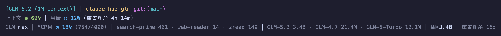

# claude-hud-glm

A Claude Code statusline plugin — context, tools, agents, todos, **plus a live GLM / 智谱 (Zhipu) or Z.ai coding-plan quota line**. A fork of [jarrodwatts/claude-hud](https://github.com/jarrodwatts/claude-hud).

> 🌐 English | [中文文档](README.md) | [GLM 额度接入说明](GLM_QUOTA.md)



Example statusline (with the GLM line, `ring` style):
```
[GLM-5.2 (1M context)] │ my-project git:(main*)
Context ◑ 37% │ Usage ◔ 7% (resets in 2h 38m)
GLM max │ MCP/mo ◔ 18% (744/4000) │ resets in 16d 14h
◐ Edit: auth.ts │ ▸ Fix login (2/5)
```

## What this fork adds

A configurable **GLM quota line**, driven by a background snapshot (the HUD never calls the network while rendering):

- **5h token quota** — reuses the native Usage bar/ring
- **Monthly MCP tool-call quota** (e.g. `744/4000`)
- Per-tool breakdown · per-model token totals · 7-day token estimate · reset countdown
- 8 independent `display.showGlm*` toggles

Full toggle list + setup notes: **[GLM_QUOTA.md](GLM_QUOTA.md)**.

> Zhipu's API exposes **no weekly quota** (the 7-day figure is a self-computed token sum, not a %); the **monthly** figure is the **MCP tool-call** quota (call count), not tokens.

## Install

In Claude Code:
```
/plugin marketplace add BND-1/claude-hud-glm
/plugin install claude-hud-glm@claude-hud-glm
/claude-hud-glm:setup
```

`/claude-hud-glm:setup` writes the statusLine (wired to the GLM fetcher), backs up the previous one, and verifies it renders.

**To see the GLM line**, add to `~/.claude/plugins/claude-hud-glm/config.json`:
```jsonc
{ "display": { "showGlmQuota": true } }
```
> Upgrading from an earlier version? Your config is auto-migrated from `~/.claude/plugins/claude-hud/` to `claude-hud-glm/` on first run.

**GLM quota requires** `ANTHROPIC_AUTH_TOKEN` + `ANTHROPIC_BASE_URL` (pointing at `open.bigmodel.cn` or `api.z.ai`) in the environment — these are already present on any machine where Claude Code itself runs against Zhipu/Z.ai. On an Anthropic setup the HUD still works; the GLM line is just empty (hidden, no error).

## Progress style

`display.barStyle`:
- `bar` (default) — `███░░░░░░░ 37%`
- `ring` — compact `◑ 37%` (single Unicode ring/pie glyph, ~5 levels)

## Everything else

This is a strict superset of [jarrodwatts/claude-hud](https://github.com/jarrodwatts/claude-hud) — every original feature is intact: context bar, active tools, running agents, todo progress, usage limits, session tokens, prompt cache, git status, cost, memory, and more. Configure them with `/claude-hud-glm:configure` or by editing `~/.claude/plugins/claude-hud-glm/config.json`. See the [upstream README](https://github.com/jarrodwatts/claude-hud#readme) for the full feature catalog.

## Sync with upstream

```bash
git remote add upstream https://github.com/jarrodwatts/claude-hud   # once
git fetch upstream && git rebase upstream/main
```
GLM-specific changes are concentrated in `src/config.ts`, `src/render/index.ts`, `src/glm-snapshot.ts`, `src/render/lines/glm-quota.ts`, and `fetch.mjs` — rebases rarely conflict.

## Credits

Forked from [jarrodwatts/claude-hud](https://github.com/jarrodwatts/claude-hud) by Jarrod Watts. GLM/Zhipu quota integration and branding added in this fork. MIT licensed.
